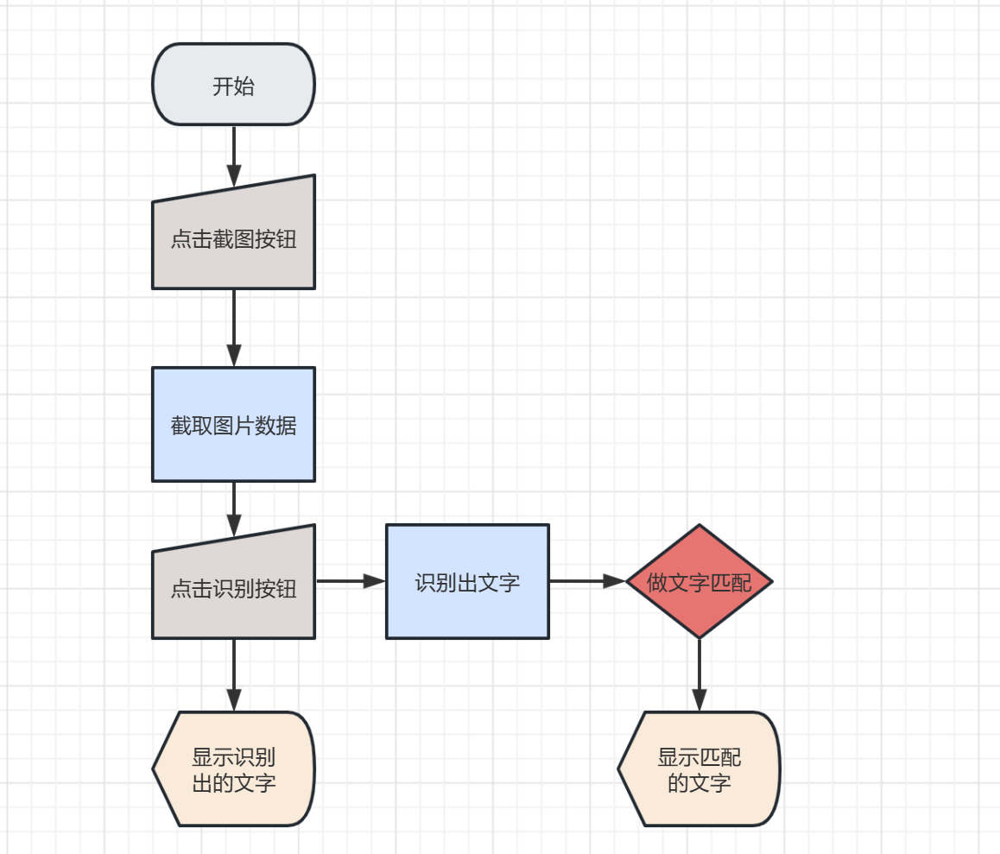
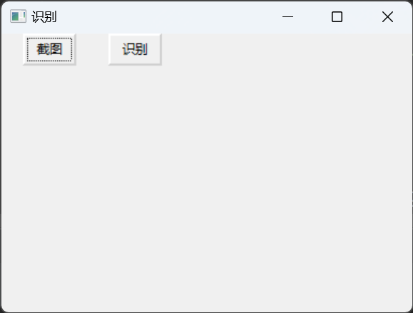
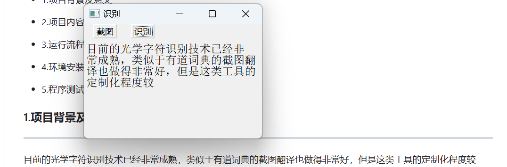

## 基于ddddocr库的图片文字识别小工具

****
- 1.项目背景及意义
- 2.项目内容
- 3.运行流程
- 4.环境安装
- 5.程序测试
- 6.不足之处及优化方向

### 1.项目背景及意义

****

目前的光学字符识别技术已经非常成熟，类似于有道词典的截图翻译也做得非常好，但是这类工具的定制化程度较低，无法做一些功能性的扩展，基于此问题，我结合现有的开源别的算法做一个简单的OCR识别程序。

### 2.项目内容

****

本项目使用python进行代码的编写，其中使用了ddddocr库作做识别，并使用wxpython做了一个简单的界面

### 3.运行流程

****

### 4.环境安装

****

这块请根据具体情况安装软件包

### 5.程序测试

****
- 程序主界面  
  
- 点击截图按钮获取整个屏幕的数据，通过鼠标控制截取出需要识别的文字
- 点击识别按钮进行识别
- 效果展示  

### 6.不足之处及优化方向
****
##### 不足之处
- 程序目前对英文和符号识别效果较差
- 识别的文字只能是单行识别，多行识别会报错
- wxpython写的界面非常简陋且功能单一

##### 优化方向
- 引入能多行识别的模型
- 优化wxpython界面，增添新功能
